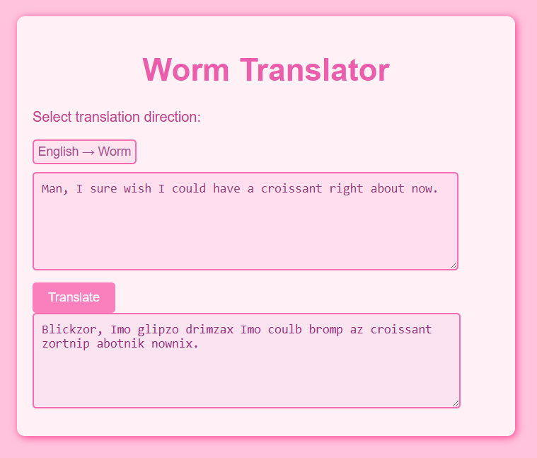

# Worm Language Translator

A **Worm Language Translator** that converts English words into their Worm equivalents!

## Features
- Translate English to Worm Language
- Translate Worm Language back to English
- Pink-themed UI
- Um its silly idk what to tell you

## How to Use
1. Select the translation direction (English → Worm or Worm → English).
2. Type your text into the input box.
3. Click the **Translate** button.
4. View the translated text in the output box.

## Pages
- [Worm Translator](https://frogtato.github.io/Worm-Translator) 

## Technologies Used
- **HTML** 
- **CSS** 
- **JavaScript** 

## Preview

## License
This project is licensed under the **Creative Commons Attribution 4.0 International (CC BY 4.0)**. See the [LICENSE](LICENSE) file for details.

## Author
Created by **Frogtato**
